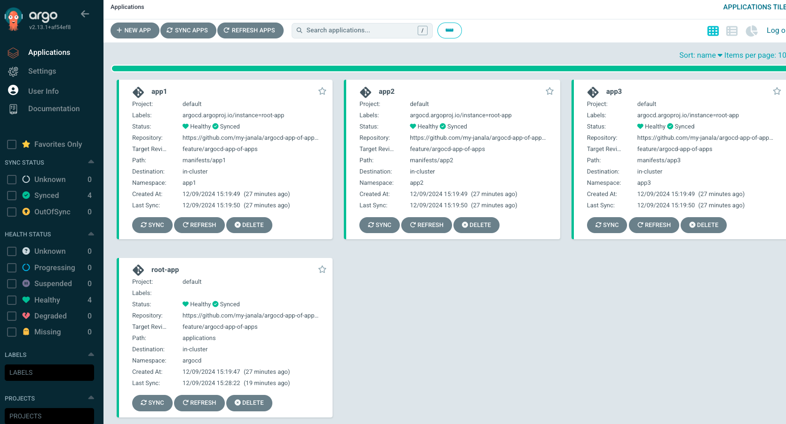

# ArgoCD-App-of-Apps

The Argo CD App of Apps model is a GitOps pattern that allows you to manage multiple applications using a single "parent" application. This parent application defines and deploys other "child" applications, making it easier to organize, scale, and control complex deployments.

## Key Features

### Parent Application (Root App)

- Acts as the central controller.
- Points to a directory (or repository) containing definitions of child applications.

### Child Applications

* Represent individual workloads or services.
* Each child application can manage its own set of Kubernetes manifests, Helm charts, or Kustomize configurations.

### Hierarchical Management

* The root application manages the child applications, while each child manages specific resources.

### Scalability

New applications can be added by simply updating the parent application configuration.

## Example

* Root Application: Deploys all the child applications by pointing to a directory containing child app definitions.
* Child Applications: Deploy and manage resources like Deployments, Services, and ConfigMaps in their respective namespaces.


### Repo Structure 

```angular2html
argocd-app-of-apps/
├── bootstrap/
│   └── root-app.yaml
├── applications/
│   ├── app1.yaml
│   ├── app2.yaml
│   └── app3.yaml
└── manifests/
    ├── app1/
    │   ├── namespace.yaml
    │   ├── deployment.yaml
    │   └── service.yaml
    ├── app2/
    │   ├── namespace.yaml
    │   ├── deployment.yaml
    │   └── service.yaml
    └── app3/
        ├── namespace.yaml
        ├── deployment.yaml
        └── service.yaml
```

## Prerequisites
- EKS Cluster: Ensure your EKS cluster is running and configured with kubectl.
- Argo CD Installed: Ensure Argo CD is installed on your EKS cluster, and you can access the Argo CD UI.
- Cluster Access: The Argo CD controller should have the appropriate permissions to manage resources in the namespaces.

### Deploying the EKS cluster

- Set the env variables

```
export AWS_ACCESS_KEY_ID=""
export AWS_SECRET_ACCESS_KEY=""
export AWS_REGION="us-west-2"
```

Based on this [configuration](./cluster/cluster.yaml) _eksctl_ will:

* Create a VPC across three availability zones
* Create an EKS cluster
* Create an IAM OIDC provider
* Add a managed node group named default
* Configure the VPC CNI to use prefix delegation

Apply the configuration file like so:

```
$ export EKS_CLUSTER_NAME=eks-workshop

$ curl -fsSL https://raw.githubusercontent.com/aws-samples/eks-workshop-v2/stable/cluster/eksctl/cluster.yaml | \
envsubst | eksctl create cluster -f -
```

Once the cluster deployment is complete, we should receive an output like the following:

```
2024-12-08 14:25:54 [✔]  created 0 nodegroup(s) in cluster "eks-workshop"
2024-12-08 14:25:55 [ℹ]  nodegroup "default" has 3 node(s)
2024-12-08 14:25:55 [ℹ]  node "ip-10-42-119-218.us-west-2.compute.internal" is ready
2024-12-08 14:25:55 [ℹ]  node "ip-10-42-142-75.us-west-2.compute.internal" is ready
2024-12-08 14:25:55 [ℹ]  node "ip-10-42-165-161.us-west-2.compute.internal" is ready
2024-12-08 14:25:55 [ℹ]  waiting for at least 3 node(s) to become ready in "default"
2024-12-08 14:25:55 [ℹ]  nodegroup "default" has 3 node(s)
2024-12-08 14:25:55 [ℹ]  node "ip-10-42-119-218.us-west-2.compute.internal" is ready
2024-12-08 14:25:55 [ℹ]  node "ip-10-42-142-75.us-west-2.compute.internal" is ready
2024-12-08 14:25:55 [ℹ]  node "ip-10-42-165-161.us-west-2.compute.internal" is ready
2024-12-08 14:25:55 [✔]  created 1 managed nodegroup(s) in cluster "eks-workshop"
2024-12-08 14:25:57 [ℹ]  kubectl command should work with "/Users/mezbaurrahman/.kube/config", try 'kubectl get nodes'
2024-12-08 14:25:57 [✔]  EKS cluster "eks-workshop" in "us-west-2" region is ready
```

- Check cluster status 

```
$ kubectl get svc 
NAME         TYPE        CLUSTER-IP   EXTERNAL-IP   PORT(S)   AGE
kubernetes   ClusterIP   172.20.0.1   <none>        443/TCP   22m
```

```
$ kubectl get nodes
NAME                                          STATUS   ROLES    AGE     VERSION
ip-10-42-119-218.us-west-2.compute.internal   Ready    <none>   2m50s   v1.30.0-eks-036c24b
ip-10-42-142-75.us-west-2.compute.internal    Ready    <none>   2m49s   v1.30.0-eks-036c24b
ip-10-42-165-161.us-west-2.compute.internal   Ready    <none>   2m51s   v1.30.0-eks-036c24b
```

You can use the following command to delete the cluster with _eksctl_:

`eksctl delete cluster $EKS_CLUSTER_NAME --wait`

### Installing Argo CD

`helm repo add argo-cd https://argoproj.github.io/argo-helm`

`helm repo update `


```
helm upgrade --install argocd argo-cd/argo-cd --version "7.7.7" \
  --namespace "argocd" --create-namespace \
  --values ~/automation/gitops/argocd/values.yaml \
  --wait
```

```
Release "argocd" does not exist. Installing it now.
NAME: argocd
LAST DEPLOYED: Sun Dec  8 14:32:21 2024
NAMESPACE: argocd
STATUS: deployed
REVISION: 1
TEST SUITE: None
NOTES:
In order to access the server UI you have the following options:

1. kubectl port-forward service/argocd-server -n argocd 8080:443

    and then open the browser on http://localhost:8080 and accept the certificate

2. enable ingress in the values file `server.ingress.enabled` and either
      - Add the annotation for ssl passthrough: https://argo-cd.readthedocs.io/en/stable/operator-manual/ingress/#option-1-ssl-passthrough
      - Set the `configs.params."server.insecure"` in the values file and terminate SSL at your ingress: https://argo-cd.readthedocs.io/en/stable/operator-manual/ingress/#option-2-multiple-ingress-objects-and-hosts
```

After reaching the UI the first time you can login with username: admin and the random password generated during the installation. You can find the password by running:

`kubectl -n argocd get secret argocd-initial-admin-secret -o jsonpath="{.data.password}" | base64 -d`

(You should delete the initial secret afterwards as suggested by the Getting Started Guide: https://argo-cd.readthedocs.io/en/stable/getting_started/#4-login-using-the-cli)

For the purpose of this lab the Argo CD server UI has been exposed outside of the cluster using Kubernetes Service of Load Balancer type. 

`
export ARGOCD_SERVER=$(kubectl get svc argocd-server -n argocd -o json | jq --raw-output '.status.loadBalancer.ingress[0].hostname')
`

```
echo "ArgoCD URL: https://$ARGOCD_SERVER"
ArgoCD URL: https://a6417a9f9c6284aa5b17c9ddbd169ef1-1446815091.us-west-2.elb.amazonaws.com
```

The load balancer will take some time to provision so use this command to wait until ArgoCD responds:

```
curl --head -X GET --retry 20 --retry-all-errors --retry-delay 15 \
  --connect-timeout 5 --max-time 10 -k \
  https://$ARGOCD_SERVER
```

```
HTTP/1.1 200 OK
Accept-Ranges: bytes
Content-Length: 788
Content-Security-Policy: frame-ancestors 'self';
Content-Type: text/html; charset=utf-8
Vary: Accept-Encoding
X-Frame-Options: sameorigin
X-Xss-Protection: 1
Date: Sun, 08 Dec 2024 14:44:24 GMT

```

The initial username is admin and the password is auto-generated. You can get it by running the following command:

```
export ARGOCD_PWD=$(kubectl -n argocd get secret argocd-initial-admin-secret -o jsonpath="{.data.password}" | base64 -d)
echo "ArgoCD admin password: $ARGOCD_PWD"
```

Log in to the Argo CD UI using the URL and credentials you just obtained.

Argo CD also provides a powerful CLI tool called argocd that can be used to manage applications.

In order to interact with Argo CD objects using CLI, we need to login to the Argo CD server by running the following commands:

```
argocd login $ARGOCD_SERVER --username admin --password $ARGOCD_PWD --insecure

'admin:login' logged in successfully
Context 'a6417a9f9c6284aa5b17c9ddbd169ef1-1446815091.us-west-2.elb.amazonaws.com' updated
```

## Apply the App of Apps Configuration

- Push the repository to GitHub: Ensure all files are pushed to your GitHub repository:

```angular2html
git add -A
git commit -m "Added App of Apps structure"
git push origin main
```

- Add the Git repository to Argo CD

Add your repository to Argo CD, so it can sync the configurations:

```
argocd repo add https://github.com/my-janala/argocd-app-of-apps.git
Repository 'https://github.com/my-janala/argocd-app-of-apps.git' added
```

```
$ argocd repo list 
TYPE  NAME  REPO                                                 INSECURE  OCI    LFS    CREDS  STATUS      MESSAGE
git         https://github.com/my-janala/argocd-app-of-apps.git  false     false  false  false  Successful 
```

- **Bootstrap Application Sync**: Apply and sync the bootstrap application:

```
kubectl apply -f bootstrap/root-app.yaml
argocd app sync root-app
```

- **Child Applications Status:** Check the status of each child application:

```angular2html
$ argocd app list
NAME      CLUSTER                         NAMESPACE  PROJECT  STATUS  HEALTH   SYNCPOLICY  CONDITIONS  REPO                                                 PATH            TARGET
app1      https://kubernetes.default.svc  app1       default  Synced  Healthy  Auto-Prune  <none>      https://github.com/my-janala/argocd-app-of-apps.git  manifests/app1  feature/argocd-app-of-apps
app2      https://kubernetes.default.svc  app2       default  Synced  Healthy  Auto-Prune  <none>      https://github.com/my-janala/argocd-app-of-apps.git  manifests/app2  feature/argocd-app-of-apps
app3      https://kubernetes.default.svc  app3       default  Synced  Healthy  Auto-Prune  <none>      https://github.com/my-janala/argocd-app-of-apps.git  manifests/app3  feature/argocd-app-of-apps
root-app  https://kubernetes.default.svc  argocd     default  Synced  Healthy  Auto-Prune  <none>      https://github.com/my-janala/argocd-app-of-apps.git  applications    feature/argocd-app-of-apps

```

One can see the bootstrap root application and the child applications like the image below:



- **Namespace Verification**: Ensure each namespace is created:


```commandline
$ kubectl get namespaces
NAME              STATUS   AGE
app1              Active   81m
app2              Active   81m
app3              Active   81m
argocd            Active   141m
default           Active   167m
kube-node-lease   Active   167m
kube-public       Active   167m
kube-system       Active   167m
```

- **Resource Deployment:** Verify that resources are deployed within their respective namespaces:

```
kubectl get all -n app1
kubectl get all -n app2
kubectl get all -n app3
```


## Roadmap


## Project status
